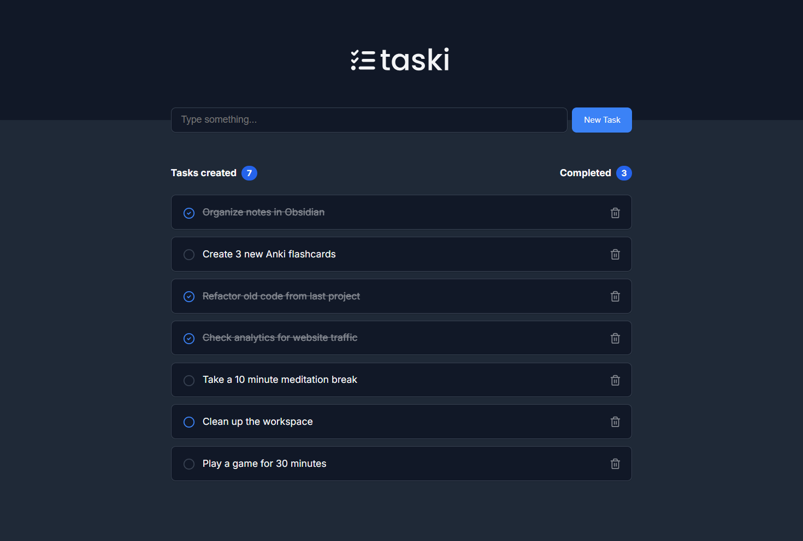
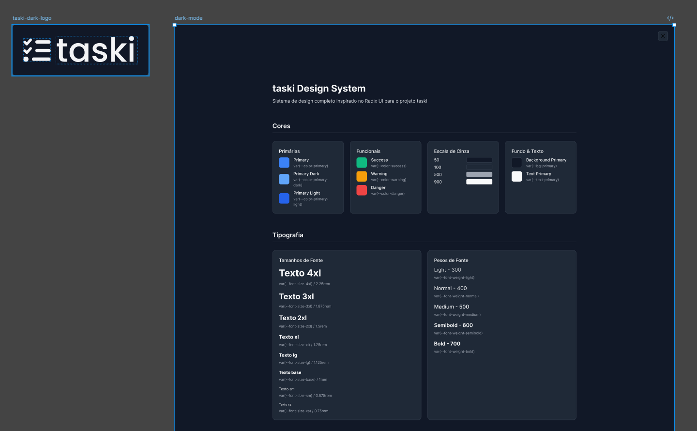
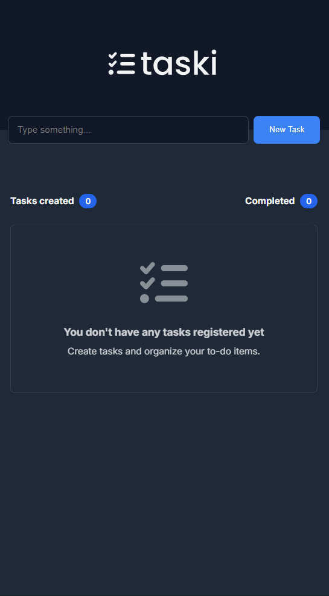

<div align="center">
  
</div>

# Taski

um gerenciador de tarefas minimalista e moderno construído com React e TypeScript.

## 📸 Screenshots

### Desktop



### Design System



### Mobile



## 🚀 Sobre o Projeto

o taski é uma aplicação de lista de tarefas desenvolvida durante meus estudos. o objetivo era criar uma interface limpa e funcional para gerenciar tarefas do dia a dia, com foco em usabilidade e design responsivo.

### Funcionalidades

- ✅ criar novas tarefas
- ✅ marcar tarefas como concluídas
- ✅ remover tarefas
- ✅ contador de tarefas criadas e concluídas
- ✅ design responsivo
- ✅ estado vazio personalizado

## 🛠️ Tecnologias

este projeto foi desenvolvido com as seguintes tecnologias:

- [React](https://react.dev/) - biblioteca JavaScript para construção de interfaces
- [TypeScript](https://www.typescriptlang.org/) - superset JavaScript com tipagem estática
- [Vite](https://vitejs.dev/) - build tool moderna e rápida
- [Lucide React](https://lucide.dev/) - ícones modernos e customizáveis
- [CSS Modules](https://github.com/css-modules/css-modules) - escopo local para CSS

## 📁 Estrutura do Projeto

```
src/
├── components/
│   ├── Header.tsx
│   ├── Header.module.css
│   ├── TaskInput.tsx
│   ├── TaskInput.module.css
│   ├── TaskItem.tsx
│   ├── TaskItem.module.css
│   ├── TasksList.tsx
│   └── TasksList.module.css
├── assets/
│   ├── taski-dark-logo.svg
│   └── empty-task.svg
├── App.tsx
├── App.module.css
├── global.css
└── main.tsx
```

## 🎨 Design System

o projeto utiliza um sistema de design consistente com variáveis CSS para:

- **cores**: esquema de cores baseado em azul (#3b82f6) com tons de cinza
- **tipografia**: fonte Inter com pesos 400 e 700
- **espaçamento**: sistema de espaçamento padronizado
- **sombras**: sombras suaves para profundidade
- **transições**: animações suaves de 150ms

## 💻 Como Executar

### Pré-requisitos

- Node.js (versão 18 ou superior)
- pnpm, npm ou yarn

### Instalação

```bash
# clone o repositório
git clone https://github.com/johnsilverio/Taski.git

# entre na pasta do projeto
cd Taski

# instale as dependências
pnpm install
# ou
npm install
```

### Executando o projeto

```bash
# modo de desenvolvimento
pnpm dev
# ou
npm run dev

# o projeto estará rodando em http://localhost:5173
```

### Build para produção

```bash
# criar build de produção
pnpm build
# ou
npm run build

# preview do build
pnpm preview
# ou
npm run preview
```

## 📝 Aprendizados

durante o desenvolvimento deste projeto, pratiquei e aprendi:
- **design system** feito do zero através do figma
- **gerenciamento de estado** com React hooks (useState)
- **componentização** e reutilização de componentes
- **TypeScript** para tipagem e interfaces
- **CSS Modules** para estilos escopados
- **manipulação de arrays** com filter e map
- **eventos de formulário** e validação
- **design responsivo** com media queries
- **boas práticas** de código e organização

## 🔧 Scripts Disponíveis

- `pnpm dev` - inicia o servidor de desenvolvimento
- `pnpm build` - cria o build de produção
- `pnpm preview` - visualiza o build de produção
- `pnpm lint` - executa o ESLint

---

<div align="center">
  feito com 💙 durante meus estudos
</div>
